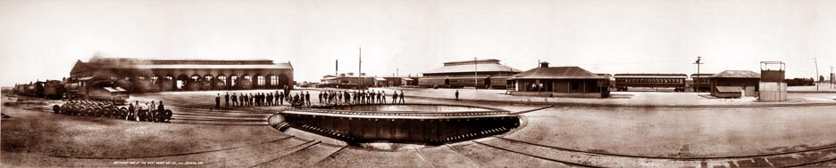

# Git Dispatcher 

## Requirements

- Python 2.6 or 2.7
 
To install the required python libraries run:
    
    sudo pip install -r requirements.txt

## Installation

## Attributions

The train roundhouse photo from [Wikimedia Commons](http://commons.wikimedia.org/wiki/File:Train_roundhose_1909.jpg) is in the
[Public Domain](http://en.wikipedia.org/wiki/public_domain).

